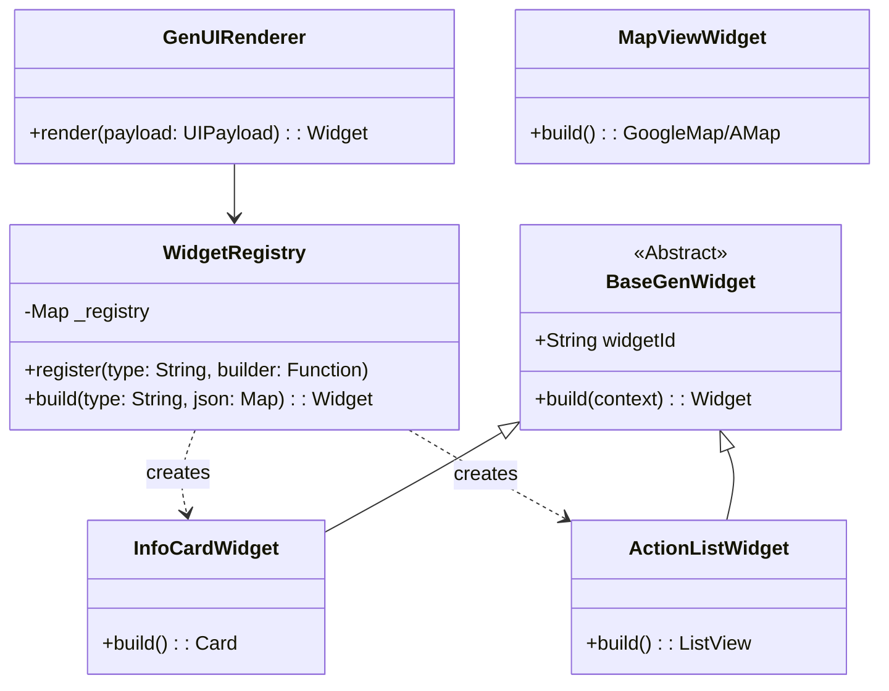

# 详细设计说明书 (DDD) - Just Now

**文档版本**：V1.4 (Final Aligned)
**项目代号**：Just Now
**适用阶段**：Coding Phase (Day 1 - Day 5)
**Last Updated**: 2026-01-29

---

## 1. 核心设计决策 (Key Design Decisions)

为了确保 5 天内完工，我们做出了以下不可更改的技术锁定：

1.  **UI 渲染协议**：使用 **Server-Driven UI (SDUI)** 模式。客户端不包含业务逻辑，只负责“翻译” JSON 为 Flutter Widget。
2.  **数据校验**：后端使用 **Pydantic V2 Discriminated Unions** 强制校验 JSON。
    *   *Note: 本 LLD 仅适用于 PoC 阶段 (Monolith)，部分校验逻辑运行在 FastAPI 层；Enterprise 版本必须将严格的 Schema Validation 迁移至 **LLM Gateway** 独立服务。*
3.  **状态管理**：前端使用 **Flutter Provider** (最轻量级) 管理 `Idle` -> `Thinking` -> `Rendering` 状态。
4.  **Mock 策略**：
    *   **Data Source**: Mock Data 通过 **Config Plane (Artifact Store)** 下发，在服务启动时加载至内存。
    *   **Coding Phase**: 为简化部署，PoC 阶段将 `mock_scenarios.json` 打包在 Docker 镜像内作为默认 Config Source，模拟“Config Center 下发”的行为。

---

## 2. 数据模型设计 (Data Model Design) [核心]

这是整个项目的灵魂。后端和前端必须严格遵守此协议。

### 2.1 UI 组件协议 (JSON Schema)

**关键原则**：
*   **Flat Structure**：移除 `data` 嵌套层，所有字段直挂。
*   **Global Unique ID**：每个组件必须包含 `widget_id`。
*   **PascalCase Types**：`InfoCard`, `ActionList`, `MapView`。

#### (1) InfoCard (信息卡片)
**用途**：显示会议纪要、代码片段、百科简介。

```json
{
  "type": "InfoCard",
  "widget_id": "card_001",
  "title": "会议纪要",
  "content_md": "1. 确认了Q1目标...\n2. 预算批准...",
  "style": "highlight" // enum: [standard, highlight, warning]
}
```

#### (2) ActionList (交互列表)
**用途**：打车比价、订餐选项、操作菜单。

```json
{
  "type": "ActionList",
  "widget_id": "list_001",
  "title": "推荐行程",
  "items": [
    {
      "id": "opt_1",
      "title": "Uber X",
      "subtitle": "3 mins away • $12.50",
      "action": {
        "type": "deep_link", // 或 "api_call"
        "url": "uber://?action=setPickup"
      }
    }
  ]
}
```

#### (3) MapView (地图)
**用途**：显示位置。

```json
{
  "type": "MapView",
  "widget_id": "map_001",
  "center": {
    "lat": 39.9042,
    "lng": 116.4074
  },
  "zoom": 14.0,
  "markers": [{"lat": 39.90, "lng": 116.41, "title": "Destination"}]
}
```

### 2.2 后端 Pydantic 模型 (Python Code Blueprint)

直接复制到你的 `backend/schemas.py`：

```python
from typing import Literal, List, Union, Optional, Annotated, Dict, Any
from pydantic import BaseModel, Field

# --- 基础组件模型 ---
class ActionModel(BaseModel):
    type: Literal["deep_link", "api_call", "toast"]
    url: Optional[str] = None
    payload: Optional[dict] = None

class ActionItem(BaseModel):
    id: str
    title: str
    subtitle: Optional[str] = None
    action: ActionModel

class LatLng(BaseModel):
    lat: float
    lng: float

class Marker(LatLng):
    title: Optional[str] = None

# --- UI 组件定义 ---
# 严格遵循 Pydantic V2 Discriminated Union 最佳实践

class InfoCard(BaseModel):
    type: Literal["InfoCard"]
    widget_id: str
    title: str
    content_md: str
    style: Literal["standard", "highlight", "warning"] = "standard"

class ActionList(BaseModel):
    type: Literal["ActionList"]
    widget_id: str
    title: str
    items: List[ActionItem]

class MapView(BaseModel):
    type: Literal["MapView"]
    widget_id: str
    center: LatLng
    zoom: float = 14.0
    # 修复：使用 default_factory 避免可变默认值陷阱
    markers: List[Marker] = Field(default_factory=list)

# --- 组件容器 Wrapper ---
class UIPayload(BaseModel):
    # 核心修正：使用 Annotated + Discriminator 确保类型识别稳定
    # 组件列表现在封装在 ui_payload 内部
    components: List[
        Annotated[
            Union[InfoCard, ActionList, MapView], 
            Field(discriminator="type")
        ]
    ]

# --- 最终响应结构 (HLD Aligned) ---
class GenUIResponse(BaseModel):
    intent_id: str
    category: Literal["SERVICE", "CHAT"] = "SERVICE"
    ui_schema_version: Literal["1.0"] = "1.0"
    slots: Dict[str, Any] = Field(default_factory=dict)
    
    # 这里对应 HLD 的 ui_payload 字段
    ui_payload: UIPayload
```

---

## 3. 接口详细设计 (API Specification)

### 3.1 Device Bind API (设备绑定)

*   **Method**: `POST`
*   **Path**: `/api/v1/device/bind`
*   **Desc**: 设备首次激活时调用，获取通信密钥。
*   **Request Body**:
    ```json
    {
      "device_fingerprint": "abcd1234efgh5678", 
      "os": "Android 12"
    }
    ```
*   **Response Body**:
    ```json
    {
      "device_id": "uuid-v4",
      "secret_key": "base64-key-material",
      "server_time": 1709999999
    }
    ```

### 3.2 Process Intent API (意图处理)

*   **Method**: `POST`
*   **Path**: `/api/v1/intent/process`
*   **Headers (Mandatory)**: 
    *   `X-Device-Id`: `uuid`
    *   `X-Signature`: `HMAC-SHA256`
    *   `X-Idempotency-Key`: `uuid`
    *   `X-Mock-Scenario`: `string` (Optional, **Internal/Staging ONLY**)
*   **Security Control**:
    *   The `X-Mock-Scenario` header MUST be stripped or ignored in **Production** environments to prevent logic bypass.
    *   It operates as a "Dev Tool" to force specific UI states for debugging/demo purposes.
*   **Content-Type**: `application/json` (Demo阶段)

**Request Body**:

```json
{
  "text_input": "帮我打车去南京南站",
  "mock_scenario": "taxi_default" 
}
```

**Response Body (Success 200)**:

返回 `GenUIResponse` 结构：

```json
{
  "intent_id": "uuid-123",
  "category": "SERVICE",
  "ui_schema_version": "1.0",
  "slots": { "destination": "南京南站" },
  "ui_payload": {
    "components": [
      {
        "type": "MapView",
        "widget_id": "map_01", 
        ...
      }
    ]
  }
}
```

### 3.3 Error Contract (错误契约)

所有非 200 响应必须符合以下格式：

```json
{
  "error_code": "E-4001",
  "message": "Signature verification failed",
  "trace_id": "trace-abc-123",
  "action": "REBIND", // enum: [RETRY, REBIND, TOAST, NONE]
  "user_tip": "安全校验失败，请重新启动应用"
}
```

### 3.4 Mock 数据文件 (mock_scenarios.json)

**Config Plane Integration**: 
此文件实际上是 Config Center 的一部分。在 Coding Phase，我们将其放置在 `backend/data/` 模拟 Config Pull 的结果。

```json
{
  "scenarios": {
    "taxi_default": {
      "intent_id": "uuid-123",
      "category": "SERVICE",
      "ui_payload": {
        "components": [
          {
            "type": "MapView",
            "widget_id": "map_01",
            "center": { "lat": 32.0, "lng": 118.7 },
            "markers": []
          },
          {
            "type": "ActionList",
            "widget_id": "list_01",
            "title": "为您找到以下车辆",
            "items": [
              {
                "id": "car_1",
                "title": "快车 - 预计 ¥35",
                "subtitle": "距您 2 分钟",
                "action": { "type": "deep_link", "url": "didi://..." }
              }
            ]
          }
        ]
      }
    },
    "code_demo": {
       "intent_id": "uuid-456",
       "category": "CHAT",
       "ui_payload": {
         "components": [
            {
              "type": "InfoCard",
              "widget_id": "code_card_01",
              "title": "Python Hello World",
              "content_md": "```python\nprint('Hello World')\n```",
              "style": "highlight"
            }
         ]
       }
    }
  }
}
```

---

## 4. 客户端组件设计 (Client Component Design)

### 4.1 类图 (Class Diagram - Flutter)

你需要实现一个 Widget Registry (组件注册表) 模式。



### 4.2 渲染器核心代码逻辑 (Dart)

直接复制到 `lib/core/renderer.dart`：

```dart
import 'package:flutter/material.dart';
import '../widgets/info_card.dart'; // 假设路径
import '../widgets/action_list.dart'; // 假设路径
import '../widgets/map_view.dart'; // 假设路径

class WidgetRegistry {
  // Key 必须匹配后端返回的 PascalCase Type
  static final Map<String, Widget Function(Map<String, dynamic>)> _builders = {
    'InfoCard': (json) => InfoCardWidget(json: json),
    'ActionList': (json) => ActionListWidget(json: json),
    'MapView': (json) => MapViewWidget(json: json),
  };

  static Widget build(Map<String, dynamic> componentJson) {
    // 扁平结构，type 直接在根级
    final type = componentJson['type'];
    
    final builder = _builders[type];
    if (builder == null) {
      return Container(
        padding: EdgeInsets.all(16),
        color: Colors.red[100],
        child: Text("Use Fallback: 不支持的组件类型: $type"),
      );
    }
    // 直接透传整个 JSON，由 Widget 内部解析字段
    return builder(componentJson);
  }
}
```
