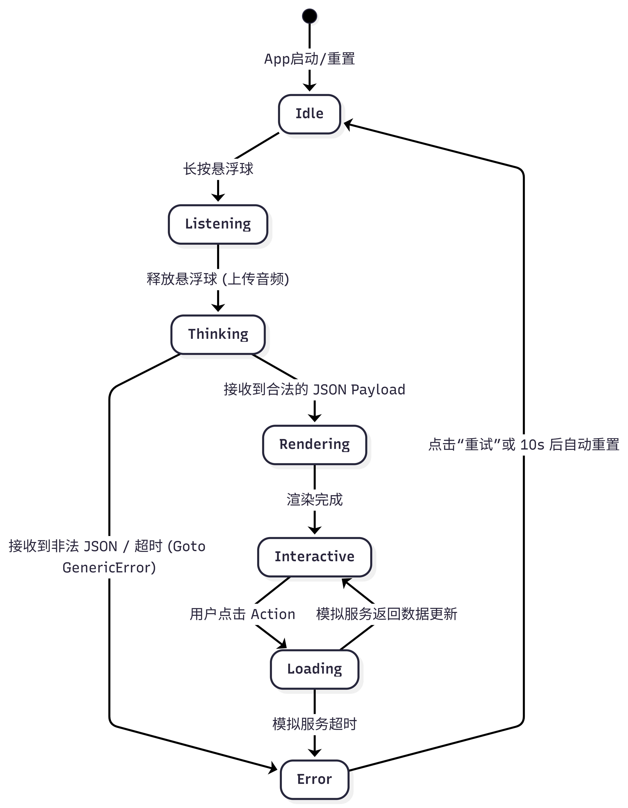
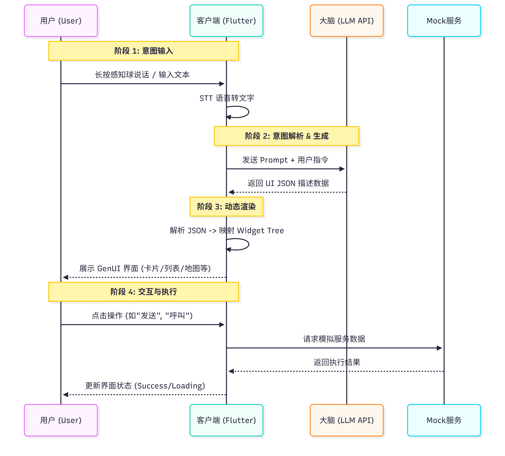
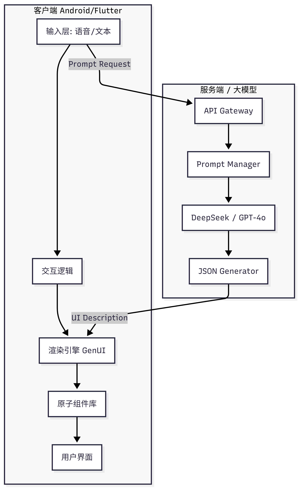

# 软件需求规格说明书 (SRS)

**项目名称**：Just Now - 意图驱动界面生成系统  
**文档版本**：V3.1 (Merged)  
**密级**：**绝密 / 仅限内部开发**  
**状态**：Final  
**最后更新**：2026-01-29

---

## 1. 引言 (Introduction)

### 1.1 编写目的
本文档为 "Just Now" 移动端系统的开发、测试、验收提供**唯一的工程依据**。
本文档中定义的任何约束（包括 Schema、状态机、SLA）均为**强制性条款**。任何对本规范的偏离必须经过架构委员会（ARB）的书面批准。

### 1.2 核心愿景 (Vision)
本项目秉持 **“Form Follows Intent” (形式追随意图)** 的理念，旨在打破传统 APP 的“货架式”布局。
应用形态为一个常驻桌面的“感知球”，根据用户意图动态实时生成最适配的交互界面（Generative UI），解决移动端“功能过载”与“服务割裂”的痛点。

### 1.3 范围 (Scope)

#### 1.3.1 包含范围 (In-Scope)
*   **多模态输入**：支持长按悬浮球语音输入及键盘文本补充。
*   **GenUI 引擎**：基于 JSON 协议动态绘制 Flutter 组件树。
*   **Mock 服务**：打车、订餐等商业服务均使用沙箱 Mock 数据。
*   **场景适配**：深度适配会议助手、智能出行、代码伴侣三个核心 Demo 场景。

#### 1.3.2 不包含范围 (Out-of-Scope)
*   **不涉及真实支付**：所有交易流程均为模拟。
*   **不替代 OS Launcher**：本应用为 App 级悬浮，不接管系统底层路由。
*   **不进行端侧训练**：完全依赖云端大模型推理，无本地 SFT。
*   **不支持流式渲染 (No Streaming)**：本项目仅支持全量 JSON 渲染 (Block Rendering)，暂不支持流式解析。渲染期间需展示 Loading 动画以缓解用户等待。

### 1.4 术语定义
| 术语 | 定义 |
| :--- | :--- |
| **User Intent** | 用户希望在此时此刻完成的一个具体、原子的任务。 |
| **GenUI** | Generative UI，基于数据描述在客户端实时绘制的非预埋原生界面。 |
| **Slot** | 意图执行所需的关键参数（如“目的地”、“时间”）。 |

---

## 2. 系统总体描述 (Overall Description)

### 2.1 用户画像 (Personas)
| 角色 | 代号 | 特征 | 痛点 | 期望 |
| :--- | :--- | :--- | :--- | :--- |
| **全场景职场人** | Alex | 频繁会议，多任务并行 | 整理录音、转文字、发邮件需在多个 APP 切换。 | 一句话“把刚才的会整理发给老板”即完成闭环。 |
| **城市探索者** | Sam | 价格敏感，注重效率 | 打车需要在多个平台比价，操作繁琐。 | 输入目的地，直接在一张列表中展示全网比价。 |
| **极客开发者** | Devin | 随时随地验证灵感 | 手机验证代码逻辑困难。 | 随时唤起代码框，运行 Python 片段。 |

### 2.2 系统边界与上下文
本系统定位为 **Android Application Level Overlay (应用层悬浮覆盖)**。


*   **权限模型**：依赖 `SYSTEM_ALERT_WINDOW` (悬浮窗) 和 `RECORD_AUDIO` (录音)。
*   **数据流向**：前端 (Thin Client) -> API Gateway -> LLM Brain。

### 2.3 假设与依赖
*   **网络环境**：需稳定的互联网连接 (>1Mbps)。
*   **设备要求**：Android 10+，需用户手动授予悬浮窗权限。
*   **服务承诺**：LLM API 可用性 > 99.9%。

---

## 3. 核心协议定义 (Core Protocol Definitions)

### 3.1 意图模型 (Intent Schema & Confidence)
系统并不盲目执行命令，而是基于置信度进行分级处理。

#### 3.1.1 Intent 数据结构
```json
{
  "type": "object",
  "required": ["intent_id", "confidence_score", "category", "slots"],
  "properties": {
    "intent_id": { "type": "string", "format": "uuid" },
    "confidence_score": { "type": "number", "minimum": 0.0, "maximum": 1.0 },
    "category": { "type": "string", "enum": ["SERVICE", "INFO", "CODE", "UNKNOWN"] },
    "slots": {
      "type": "object",
      "required": [], 
      "additionalProperties": true
    }
  }
}
```

#### 3.1.2 置信度判定规则 (Confidence Rules)
| 区间 | 判定结果 | 前端行为 |
| :--- | :--- | :--- |
| **[0.85, 1.00]** | **Confirmed** (明确) | 直接进入 Rendering 状态。 |
| **[0.60, 0.85)** | **Ambiguous** (存疑) | 显示“确认卡片”供用户二次确认。 |
| **[0.00, 0.60)** | **Rejected** (拒绝) | 丢弃意图，显示“意图无法识别”提示。 |

#### 3.1.3 Slot 完整性校验
*   **规则**：若 `category` 定义了必填 Slot (如 Taxi 需 Destination)，但 LLM 未提取到，视为 **Intent Invalid**，进入 Error 状态。

### 3.2 GenUI 渲染协议 (JSON Schema Validation)
前端渲染引擎并不“尽力而为”，而是“严格合规”。

#### 3.2.1 基础校验原则
1.  **ID Uniqueness**: 整个 JSON 树中 `widget_id` 必须全局唯一。
2.  **Fail-Fast**: JSON 校验失败（字段缺失/类型错误）将直接导致整个 UI 渲染失败，不进行降级渲染。

#### 3.2.2 组件白名单 (Widget Whitelist)
仅支持以下 Type，其他 Type 抛出 `UnsupportedWidgetException`.

**1. InfoCard** (信息展示)
```json
{
  "type": "InfoCard",
  "widget_id": "req_unique_string",
  "style": { "padding": 16, "bg_color": "#FFFFFF" },
  "content_md": "req_string" // 支持 Markdown
}
```

**2. ActionList** (列表交互)
```json
{
  "type": "ActionList",
  "widget_id": "req_unique_string",
  "items": [
    { 
      "id": "req_string", 
      "label": "req_string", 
      "action_type": "DEEP_LINK | API_CALL",
      "action_id": "req_string", 
      "scheme_url": "opt_string", 
      "sub_label": "opt_string" 
    }
  ]
}
```

**3. MapView** (地图定位)
```json
{
  "type": "MapView",
  "widget_id": "req_unique_string",
  "center": { "lat": "req_double", "lng": "req_double" },
  "markers": [ { "lat": "req_double", "lng": "req_double", "label": "string" } ]
}
```

**4. WebView** (通用网页)
```json
{
  "type": "WebView",
  "widget_id": "req_unique_string",
  "url": "req_url_string",
  "height_ratio": 0.8
}
```

---

## 4. 系统行为模型 (System Behavior)

### 4.1 状态机流转图


### 4.2 状态转移表 (Transition Table)
客户端必须依据下表实现状态流转，处理所有边界情况。

| 当前状态 | 事件 (Event) | 前置条件 | 次态 (Next State) | 动作 (Action) |
| :--- | :--- | :--- | :--- | :--- |
| **Idle** | LongPress_Start | 无 | **Listening** | 启动录音，显示波纹 |
| **Listening** | LongPress_Release | Duration < 1s | **Idle** | Toast "说话时间太短" |
| **Listening** | LongPress_Release | Duration >= 1s | **Thinking** | 停止录音，发送 API 请求 |
| **Thinking** | API_Response | HTTP 200 && Valid JSON | **Rendering** | 解析 JSON，构建 Widget 树 |
| **Thinking** | API_Response | Invalid / Error | **Error** | 显示错误状态 |
| **Thinking** | User_Touch_Outside | 无 | **Idle** | 取消请求 (Abort) |
| **Rendering** | Render_Complete | 无 | **Interactive** | UI 可见并响应交互 |
| **Interactive** | Widget_Click | action_type == Submit | **Loading** | 局部组件 Loading |
| **Error** | Timeout (10s) | 无 | **Idle** | 自动重置 |

---

## 5. 功能需求 (Functional Requirements)

### 5.1 输入处理
*   **FR-00 [权限引导]**: 应用首次启动时检测权限状态。若无悬浮窗或录音权限，不进入 Idle 状态，而是显示全屏引导页 (Onboarding)，跳转系统设置页，获得授权后方可初始化。
*   **FR-01 [语音采集]**: 采样率 16kHz，支持实时波形反馈。
*   **FR-02 [时间限制]**: 录音最长 15秒，超时自动截断发送。

### 5.2 核心场景需求 (Business Scenarios)

| ID | 场景名称 | 输入示例 | 验收标准 (Acceptance Criteria) |
| :--- | :--- | :--- | :--- |
| **SC-A** | **会议助手** | “把录音整理发给老板” | 1. 意图为 `SERVICE`。<br>2. 渲染 InfoCard 显示摘要。<br>3. ActionList 含“发送”按钮，点击模拟发送成功。 |
| **SC-B** | **智能出行** | “打车去最近的地铁站” | 1. 意图为 `SERVICE`，Slot 含目的地。<br>2. **必须**包含 MapView 组件。<br>3. ActionList 显示至少 2 个价格选项。 |
| **SC-C** | **代码伴侣** | “写个 Python Hello World” | 1. 意图为 `CODE`。<br>2. InfoCard 内容必须包含 \`\`\`python 代码块。<br>3. 含“运行”按钮，点击输出结果。 |

---

## 6. 非功能需求与 SLA (NFR & SLA)

### 6.1 性能响应预算 (Latency Budget)
定义：从用户松手 (`Listening_End`) 到首屏渲染完成 (`Render_Complete`)。

| 阶段 | 目标值 | **失效阈值 (Failure)** |
| :--- | :--- | :--- |
| **STT + Upload** | 800ms | **3.0s** |
| **LLM Inference** | 2.0s | **5.0s** |
| **Payload Network** | 200ms | **1.0s** |
| **Total Roundtrip** | **3.1s** | **9.5s** (超过即报系统不可用) |

### 6.2 安全与隐私 (Security & Compliance)
1.  **Ephemeral Storage (瞬时存储)**：语音文件仅在内存暂存，请求结束后立即销毁，**严禁落盘**。
2.  **No Training (禁止训练)**：所有用户数据仅用于单次推理，不得用于模型微调 (SFT) 或强化学习。
3.  **Data Masking (日志脱敏)**：Logcat 中严禁打印包含 PII (个人敏感信息) 的原始文本。

### 6.3 兼容性
*   **OS**: Android 10+ (API Level 29+)。
*   **Screen**: 适配 360dp-480dp 宽度，支持刘海屏避让。
*   **IME Adaptation**: 当软键盘弹起时，GenUI 容器需自动上移 `MediaQuery.of(context).viewInsets.bottom` 高度，防止输入框被遮挡。

---

## 7. 补充验证场景 (Supplemental Scenarios)

本节包含从历史版本 (V2.0) 继承的关键测试用例，用于辅助验证系统健壮性。

| ID | 场景 | 输入 | 预期结果 |
| :--- | :--- | :--- | :--- |
| **TC-01** | **正常意图** | 语音：“在这个地方创建一个打车订单” | 1. 状态流转 Listening->Thinking->Interactive<br>2. 出现 ActionList 组件包含价格。 |
| **TC-02** | **非法 JSON** | (Mock) 后端返回 `{"foo": "bar"}` | 1. 状态流转 Thinking -> Error<br>2. 屏幕显示“服务暂时不可用 (E-1001)”。 |
| **TC-03** | **无权限** | 首次启动未给悬浮窗权限 | App 显示引导页，点击“去设置”跳转系统设置页。 |

---

## 8. 验收标准清单 (DoD)
1.  [ ] **Unit Test**: JSON Parser 覆盖率 100%。
2.  [ ] **Integration Test**: 三大核心场景 (SC-A/B/C) 在模拟器中跑通。
3.  [ ] **Performance**: 弱网下能正确触发 SLA 报错机制。
4.  [ ] **Privacy**: 静态代码分析确认无敏感 API 调用 (如写外部存储)。

---

## 9. 附录 A：系统全景图 (System Architecture Appendix)
本附录收录历史版本中的架构视图，供开发参考。

### A.1 V1 架构概念图
**LLM GenUI Rendering Pipeline**


**GenUI Prompt to Render Flow**


---

**Approval**
Project Manager: _________________
Tech Lead: _________________

